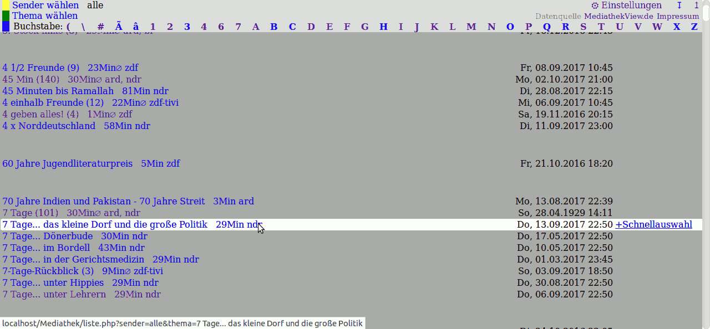

Das Web-Programm listet die Filmliste vom MediathekView Projekt.  
Optimiert für SmartTV / TV-Browser  

### mediathek-ListePHP
DemoServer: http://149.202.236.159/  
DemoVideo(August2017): https://youtu.be/DLFDfNCTSYQ  
Für Vestel/Telefunken als TV-App (DNS-Hack): https://youtu.be/GwNNpYhJq94  

### Server-Vorraussetzungen
Stand 8/2017  
- PHP5
- RAM: sollten > 450MB (notfalls 256MB)
- Speicherplatz: Sollten 570MB (notfalls 240MB)
- Speicher-Vorraussetzungen im Detail: https://github.com/soerenj/mediatheklistePHP/wiki/Speicher-Vorraussetzungen-im-Detail

Muss installiert sein auf den Server:  
Mindestens:  
- PHP mit cURL  
- wenn nur mindestens vorliegt: der Filmlisten-Download läuft über externen WebSerice (muss man sich anmelden)  

Empfohlen:  
- ausführen von Befehlen erlauben ("exec")
- installierte Programme: wget xz-utils curl (sollte bei etwas besseren Webhosting standart sein(?))

==================================================

Lizenz:  GNU Affero General Public License (APGL)  
Außerdem enthaltener Code: 
        triviale Code-Auszügen von  
                Javascript createCookie()/getCookie(): https://stackoverflow.com/questions/4014935/why-doesnt-this-javascript-focus-work  
                Javascript formItemFocus(): https://stackoverflow.com/questions/4825683/how-do-i-create-and-read-a-value-from-cookie  

