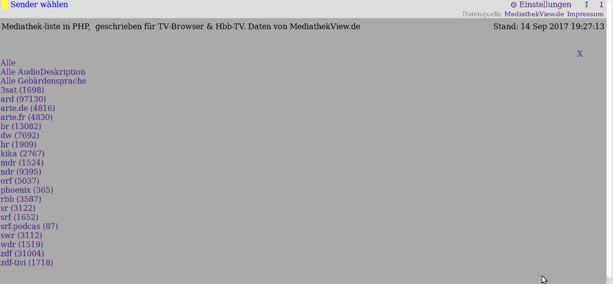

Lizenz: APGL  

DemoServer: http://149.202.236.159/

Das Web-Programm listet die Filmliste vom MediathekView Projekt.

DemoVideo(August2017): https://youtu.be/DLFDfNCTSYQ  
Als SmartTV-App auf Vestel/Telefunken installieren: https://youtu.be/GwNNpYhJq94

Vorraussetzungen (Stand 8/2017):
- PHP5
- RAM: sollten > 450MB (notfalls 256MB)
- Speicherplatz: Sollten 570MB (notfalls 240MB)

Muss installiert sein auf den Server:  
Mindestens:  
- Dann läuft der Filmlisten-Download über externen WebSerice (muss man sich anmelden)
- PHP mit cURL  
Empfohlen:  
- ausführen von Befehlen erlauben ("exec")
- installierte Programme: wget xz-utils curl (sollte bei etwas besseren Webhosting standart sein(?))

====== Speicher-Vorraussetzungen im Detail ======

Die Filmlisten-Datei wird vom MediathekView Projekt herruntergeladen.
Größe der Datei (Stand 8/2017 ): ~110MB  
Nach dieser Datei richtet sich der RAM/Speicher-Bedarf vom Server.

 RAM:  
- Mindestens: 256MB (ohne Cache) (2x Filmliste + X)
- Mindestens: 450MB (bei aktiven Cache; Zum Zeitpunkt der Cache-Erstellung)

 Speicher auf der Festplatte:
- Mindestens: 240MB (ohne Cache)
- Mindestens: 650MB (mit Cache)
- Speicherbedarf besteht aus:  
          kompremierte Filmliste 20MB; 
          Filmlisten-Datei 110MB; 
          alte Kopie der Filmlisten-Datei 110MB; 
          Cache Filmliste je Sender (abschaltbar) 110MB; 
          Cache Filmliste je Thema (abschaltbar) 110MB; 
          Cache Filmliste je Thema alle Sender (abschaltbar) 110MB; 

==================================================

Lizenz:  GNU Affero General Public License (APGL)  
Außerdem enthaltener Code: 
        triviale Code-Auszügen von  
                Javascript createCookie()/getCookie(): https://stackoverflow.com/questions/4014935/why-doesnt-this-javascript-focus-work  
                Javascript formItemFocus(): https://stackoverflow.com/questions/4825683/how-do-i-create-and-read-a-value-from-cookie  

